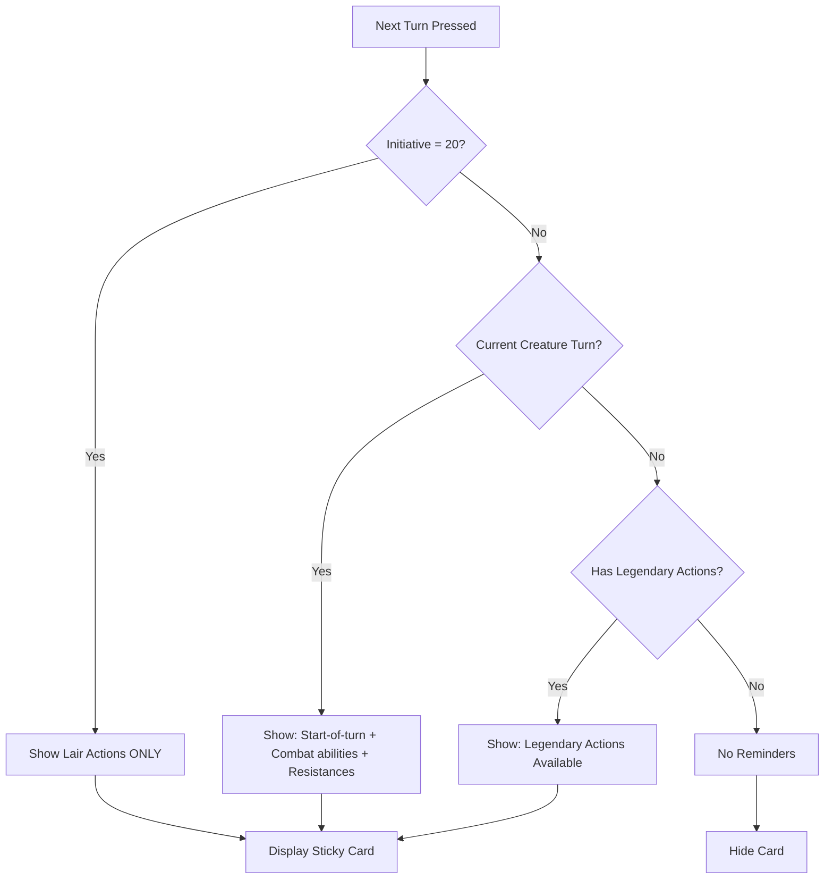

# 🎯 Claude Code Instructions: DM Reminder Card System Implementation

## **📋 Project Overview**
Implement a contextual reminder card system for the D&D Encounter Builder that helps DMs remember creature abilities, timing-based effects, and combat mechanics at the appropriate moments during gameplay.

## **🔧 Implementation Requirements**

### **1. Data Structure & Creature Database**
Create an API-friendly creature abilities database:

```typescript
// types/creature-abilities.ts
interface CreatureAbility {
  type: 'start_of_turn' | 'end_of_turn' | 'legendary_actions' | 'lair_actions' | 'combat_ability' | 'resistance' | 'concentration';
  name: string;
  description: string;
  priority: 'critical' | 'high' | 'medium' | 'low';
  timing?: string; // "initiative 20", "start of turn", etc.
  count?: number; // for legendary actions tracking
}

interface CreatureTemplate {
  name: string;
  cr: string;
  abilities: CreatureAbility[];
}

// Example creature data
const CREATURE_ABILITIES: CreatureTemplate[] = [
  {
    name: "Ancient Red Dragon",
    cr: "24",
    abilities: [
      {
        type: "start_of_turn",
        name: "Regeneration",
        description: "Regains 20 hp unless took cold damage",
        priority: "high"
      },
      {
        type: "legendary_actions", 
        name: "Legendary Actions",
        description: "3 actions at end of other turns",
        priority: "high",
        count: 3
      },
      {
        type: "lair_actions",
        name: "Lair Actions", 
        description: "Initiative 20: Tremor, fire jets, or toxic gases",
        priority: "critical",
        timing: "initiative 20"
      },
      {
        type: "combat_ability",
        name: "Breath Weapon",
        description: "Recharge 5-6: Fire breath (90 ft cone)",
        priority: "high"
      },
      {
        type: "resistance",
        name: "Immunities & Resistances",
        description: "Fire immunity, resistant to physical damage",
        priority: "medium"
      }
    ]
  },
  {
    name: "Goblin",
    cr: "1/4", 
    abilities: [
      {
        type: "combat_ability",
        name: "Pack Tactics", 
        description: "Advantage on attacks with ally within 5ft",
        priority: "high"
      }
    ]
  }
  // Add more creatures: Orc, Lich, Giants, etc.
];
```

### **2. Reminder Card Component**
Create a sticky header reminder card component:

```typescript
// components/DMReminderCard.tsx
interface DMReminderCardProps {
  creature: Combatant;
  currentTurn: number;
  round: number;
  initiative: number;
  onDismiss: () => void;
}

const DMReminderCard: React.FC<DMReminderCardProps> = ({
  creature, currentTurn, round, initiative, onDismiss
}) => {
  const reminders = getContextualReminders(creature, currentTurn, initiative);
  
  if (reminders.length === 0) return null;
  
  return (
    <div className="fixed top-20 left-1/2 transform -translate-x-1/2 z-50 
                    bg-amber-50/95 border-2 border-amber-600 backdrop-blur 
                    max-w-2xl w-11/12 rounded-lg shadow-xl">
      
      {/* Header */}
      <div className="flex justify-between items-center p-3 border-b border-amber-200">
        <h3 className="font-bold text-amber-900 text-lg flex items-center gap-2">
          🔥 {creature.name} - Turn {round}
        </h3>
        <button onClick={onDismiss} className="text-amber-600 hover:text-amber-800">
          ✕
        </button>
      </div>

      {/* Two-Column Layout */}
      <div className="grid grid-cols-2 gap-4 p-4">
        
        {/* Left Column: Time-Sensitive */}
        <div className="space-y-3">
          <h4 className="font-semibold text-green-700 text-sm flex items-center gap-1">
            🟢 START OF TURN
          </h4>
          {reminders.filter(r => r.type === 'start_of_turn').map((reminder, idx) => (
            <div key={idx} className="text-sm">
              • {reminder.description}
            </div>
          ))}
          
          <h4 className="font-semibold text-blue-700 text-sm flex items-center gap-1">
            🛡️ DEFENSES  
          </h4>
          {reminders.filter(r => r.type === 'resistance').map((reminder, idx) => (
            <div key={idx} className="text-sm">
              • {reminder.description}
            </div>
          ))}
        </div>

        {/* Right Column: Always Available */}
        <div className="space-y-3">
          <h4 className="font-semibold text-purple-700 text-sm flex items-center gap-1">
            ⚡ ABILITIES AVAILABLE
          </h4>
          {reminders.filter(r => ['combat_ability', 'legendary_actions'].includes(r.type)).map((reminder, idx) => (
            <div key={idx} className="text-sm">
              • {reminder.description}
            </div>
          ))}
          
          <h4 className="font-semibold text-orange-700 text-sm flex items-center gap-1">
            📍 SPECIAL
          </h4>
          {reminders.filter(r => r.type === 'lair_actions').map((reminder, idx) => (
            <div key={idx} className="text-sm">
              • {reminder.description}
            </div>
          ))}
        </div>
      </div>
    </div>
  );
};
```

### **3. Contextual Logic System** 
Implement intelligent filtering based on game state:

```typescript
// utils/reminder-logic.ts
const getContextualReminders = (
  creature: Combatant, 
  currentTurn: number, 
  initiative: number
): CreatureAbility[] => {
  const creatureTemplate = CREATURE_ABILITIES.find(c => c.name === creature.name);
  if (!creatureTemplate) return [];
  
  const reminders: CreatureAbility[] = [];
  const isCreatureTurn = creature.id === currentTurn;
  
  // Lair Actions (Initiative 20) - HIGHEST PRIORITY
  if (initiative === 20) {
    const lairActions = creatureTemplate.abilities.filter(a => a.type === 'lair_actions');
    if (lairActions.length > 0) {
      return lairActions; // Return ONLY lair actions, override everything else
    }
  }
  
  // Start-of-turn effects (only on creature's turn)
  if (isCreatureTurn) {
    reminders.push(...creatureTemplate.abilities.filter(a => 
      ['start_of_turn', 'combat_ability', 'resistance'].includes(a.type)
    ));
  }
  
  // Legendary Actions (only when NOT creature's turn)
  if (!isCreatureTurn && creature.isLegendaryCreature) {
    reminders.push(...creatureTemplate.abilities.filter(a => 
      a.type === 'legendary_actions'
    ));
  }
  
  // Limit to prevent information overload
  return reminders.slice(0, 6);
};

// Lair action special handling
const checkForLairActions = (initiative: number, creatures: Combatant[]): Combatant[] => {
  if (initiative !== 20) return [];
  
  return creatures.filter(creature => {
    const template = CREATURE_ABILITIES.find(c => c.name === creature.name);
    return template?.abilities.some(a => a.type === 'lair_actions');
  });
};
```

### **4. Integration with Existing App**
Modify the main App.tsx to include the reminder system:

```typescript
// In App.tsx - Add new state
const [showReminders, setShowReminders] = useState(true);
const [activeReminders, setActiveReminders] = useState<Combatant[]>([]);

// Modify nextTurn function
const nextTurn = () => {
  if (!activeEncounter?.creatures.length) return;
  
  let nextTurnIndex = currentTurn + 1;
  let nextRound = currentRound;
  
  if (nextTurnIndex >= activeEncounter.creatures.length) {
    nextTurnIndex = 0;
    nextRound += 1;
  }
  
  setCurrentTurn(nextTurnIndex);
  setCurrentRound(nextRound);
  
  // Check for reminders after turn change
  updateReminders(nextTurnIndex, nextRound);
};

// New reminder update function
const updateReminders = (turnIndex: number, round: number) => {
  if (!activeEncounter) return;
  
  const currentCreature = activeEncounter.creatures[turnIndex];
  const initiative = currentCreature?.initiative || 0;
  
  // Check for lair actions
  if (initiative === 20) {
    const lairCreatures = checkForLairActions(initiative, activeEncounter.creatures);
    setActiveReminders(lairCreatures);
  } else if (currentCreature) {
    // Check for creature-specific reminders
    const hasReminders = getContextualReminders(currentCreature, turnIndex, initiative);
    if (hasReminders.length > 0) {
      setActiveReminders([currentCreature]);
    } else {
      setActiveReminders([]);
    }
  }
};

// Add to render
{showReminders && activeReminders.map(creature => (
  <DMReminderCard 
    key={creature.id}
    creature={creature}
    currentTurn={currentTurn} 
    round={currentRound}
    initiative={creature.initiative}
    onDismiss={() => setActiveReminders([])}
  />
))}
```

### **5. Enhanced Creature Database**
Expand the creature abilities database with priority creatures:

```typescript
// Add these creatures to CREATURE_ABILITIES array:

// Common creatures DMs forget abilities for
{
  name: "Lich",
  cr: "21", 
  abilities: [
    {
      type: "legendary_actions",
      name: "Legendary Actions", 
      description: "3 actions: Cantrip, Paralyzing Touch, Disrupt Life",
      priority: "critical",
      count: 3
    },
    {
      type: "concentration", 
      name: "Spellcasting",
      description: "May lose concentration when damaged",
      priority: "high"
    },
    {
      type: "resistance",
      name: "Resistances",
      description: "Immune: cold, lightning, necrotic. Resistant: non-magical physical",
      priority: "medium"
    }
  ]
},

{
  name: "Orc",
  cr: "1/2",
  abilities: [
    {
      type: "combat_ability",
      name: "Aggressive", 
      description: "Bonus action: move toward hostile creature",
      priority: "high"
    }
  ]
},

{
  name: "Troll",
  cr: "5",
  abilities: [
    {
      type: "start_of_turn",
      name: "Regeneration",
      description: "Regains 10 HP (disabled by acid/fire damage)",
      priority: "high"
    },
    {
      type: "resistance",
      name: "Resistances", 
      description: "Regeneration stopped by acid or fire",
      priority: "medium"
    }
  ]
},

{
  name: "Beholder",
  cr: "13",
  abilities: [
    {
      type: "start_of_turn",
      name: "Eye Rays",
      description: "Roll 3 eye rays at different targets",
      priority: "critical"
    },
    {
      type: "combat_ability",
      name: "Antimagic Cone", 
      description: "150ft cone negates magic (including own eye rays)",
      priority: "high"
    },
    {
      type: "legendary_actions",
      name: "Legendary Actions",
      description: "3 actions: Eye ray or move",
      priority: "high",
      count: 3
    }
  ]
},

{
  name: "Vampire",
  cr: "13",
  abilities: [
    {
      type: "start_of_turn", 
      name: "Regeneration",
      description: "Regains 20 HP (disabled in sunlight/running water)",
      priority: "high"
    },
    {
      type: "legendary_actions",
      name: "Legendary Actions",
      description: "3 actions: Move, Unarmed Strike, Bite (costs 2)",
      priority: "high", 
      count: 3
    },
    {
      type: "resistance",
      name: "Resistances",
      description: "Resistant: necrotic, non-magical physical",
      priority: "medium"
    }
  ]
},

// Add more: Giants, Undead, Spellcasters, etc.
```

### **6. Settings & Customization**
Add a settings toggle for reminder system:

```typescript
// Add to header controls
<button 
  onClick={() => setShowReminders(!showReminders)}
  className={`px-3 py-2 rounded-lg flex items-center gap-1 ${
    showReminders ? 'bg-blue-600 text-white' : 'bg-gray-200 text-gray-700'
  }`}
>
  💡 DM Reminders
</button>
```

### **7. Testing & Validation**
Test scenarios to implement:

1. **Dragon Turn**: Show regeneration, breath weapon, resistances
2. **Initiative 20**: Show lair actions, hide other reminders  
3. **Legendary Creatures**: Show legendary actions on other creatures' turns
4. **Pack Tactics**: Show when goblin/orc is on turn
5. **Spellcaster Damage**: Show concentration reminder
6. **Turn Progression**: Verify reminders change appropriately
7. **Lair Actions Priority**: Ensure lair actions override all other reminders
8. **Information Overload Prevention**: Max 6 reminders displayed

### **8. File Structure**
Organize the new files:

```
src/
├── features/
│   └── combat-tracker/
│       ├── components/
│       │   └── DMReminderCard.tsx
│       ├── data/
│       │   └── creature-abilities.ts
│       └── utils/
│           └── reminder-logic.ts
├── types/
│   └── creature-abilities.ts
└── App.tsx (modified)
```

## **🎯 Success Criteria**

1. **Contextual Display**: Reminders only appear when relevant to current game state
2. **Information Hierarchy**: Most important information is immediately visible in columns
3. **Game Flow**: System enhances rather than interrupts gameplay
4. **DM Usability**: "At a glance" information access following DM screen conventions
5. **Performance**: No lag when switching turns or updating reminders
6. **Sticky Positioning**: Cards remain visible during scrolling (like physical DM screens)
7. **Smart Filtering**: Lair actions override other reminders, legendary actions only show on others' turns

## **🔄 Turn-Based Logic Flow**



## **📈 Future Enhancements** (Post-Implementation)
- LLM integration for custom creature ability extraction
- Homebrew creature support via manual entry
- Audio notifications for critical reminders (optional)
- Player-facing condition displays
- Integration with condition duration tracking
- Breath weapon recharge tracking
- Legendary resistance counter
- Custom DM notes per creature

## **💡 Implementation Tips**

1. **Start Small**: Begin with 3-4 common creatures (Goblin, Dragon, Orc, Lich)
2. **Test Iteratively**: Verify turn-based logic works before adding more creatures
3. **Focus on UX**: Ensure cards don't obstruct gameplay view
4. **Performance First**: Lazy load creature abilities, avoid re-renders
5. **Accessibility**: Ensure screen readers can access reminder content
6. **Mobile Responsive**: Cards should work on tablet-sized screens

## **🚨 Critical Implementation Notes**

- **Lair Actions Priority**: When initiative hits 20, ONLY show lair action reminders
- **Turn-Based Filtering**: Legendary actions never show on creature's own turn
- **Information Limits**: Max 6 total reminders to prevent cognitive overload
- **Sticky Positioning**: Cards use `position: fixed` to stay visible during scroll
- **One Card Rule**: Only one reminder card visible at a time
- **Smart Dismissal**: Cards auto-dismiss on turn change, manual dismiss available

Implement this system incrementally, starting with the core data structure and DMReminderCard component, then integrating with the existing turn management system.
